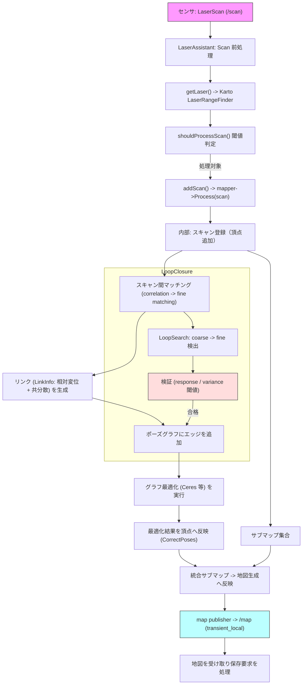

## はじめに — 本書の読み方

この文書は `slam_toolbox` パッケージの主要な内部処理を、順を追って理解できるように整理したものです。

以下の短い「全体概要」と「目次」を先に示します。まずはここを読んでから、興味のある章へジャンプしてください。

### 全体概要 (Overview)

- slam_toolbox は Karto をコアにした 2D レーザ SLAM 実装で、スキャン前処理、二段階マッチング（coarse → fine）、サブマップ生成、ポーズグラフ管理、そしてプラグイン化されたポーズグラフ最適化（デフォルト Ceres）を組み合わせて動作します。
- 運用上は RViz プラグインや map_saver、merge_maps_kinematic といった補助ノードを利用して可視化・地図保存・サブマップ統合を行います。
- 本ドキュメントは設計、内部アルゴリズム、実装上の注意点、運用ノードの使い方までをカバーします。

### 目次

1. はじめに — 本書の読み方 (この節)
2. 全体アーキテクチャ（高レベル）
3. 入力と前処理（LaserScan → Karto）
4. スキャンマッチング（coarse → fine）
5. ポーズグラフ（頂点・エッジ・情報行列）
6. ポーズグラフ最適化（デフォルト: Ceres）
7. ループクロージャー検出と処理
8. サブマップと占有格子生成
9. サブマップ統合と地図保存（運用ノード）
10. 高レベル処理フロー（図）
11. 実装上の注意点とパラメータチューニング
12. 参考ファイルと提供ツール一覧

参照実装の主なファイル（索引用）

- `src/slam_toolbox/src/slam_mapper.cpp` — SMapper（`karto::Mapper` ラッパー）
- `src/slam_toolbox/src/loop_closure_assistant.cpp` — ループクロージャ支援・RViz インタラクション
- `solvers/ceres_solver.cpp` — デフォルトのポーズグラフ最適化器（Ceres）
- `src/laser_utils.cpp` — LaserScan を Karto 表現に変換するユーティリティ
- `include/slam_toolbox/visualization_utils.hpp` — Karto → ROS `OccupancyGrid` 変換

以下は目次に沿って解説します。

## 設計観点：Karto を中心とした構成

slam_toolbox のコアは `karto::Mapper`（以下 Karto）を中心に回っていますが、運用上は Karto 単体ではなく複数のコンポーネントが組み合わさった構成になっています。ここでは全体アーキテクチャの役割分担を明示します。

- Karto（`karto::Mapper`）: スキャンの内部表現、スキャン間のコリレーション／ローカルなスキャンマッチング、頂点（スキャンノード）／エッジ（LinkInfo: 相対変位＋共分散）の管理、サブマップ生成、占有格子作成の主要ロジックを担う。
- ROS ラッパー & 前処理: `laser_utils` による `LaserScan` → Karto 用 `LaserRangeFinder` 表現への変換、TF でのセンサ姿勢補正、受信間引き（shouldProcessScan）など。
- 最適化プラグイン（デフォルト: Ceres）: ポーズグラフ最適化をプラグイン化しており、Ceres を用いた大域最適化や robust loss、線形ソルバの選定などを行う責任を持つ（`solvers/ceres_solver.cpp`）。
- 補助ノード: ループ検出支援・可視化（`loop_closure_assistant`）、サブマップ統合（`merge_maps_kinematic`）、地図保存（`map_saver`）などの運用機能。

このため「Karto を核にした SLAM フレームワーク」に分類できます。Karto がマッチングと地図生成の多くを担い、Ceres 等がグラフ最適化の役割を分担する形です。

## Karto の特徴と要素技術

Karto（karto::Mapper）は古典的なレーザ SLAM 向けに設計されたライブラリで、slam_toolbox で使われる主な特徴は次の通りです。

- 粗探索（correlation）＋微調整（局所最適化）の二段階マッチング
	- 粗探索は離散化した探索空間（x,y,θ）で相関を評価して初期解を得る。これにより大きな初期ずれに対しても候補検出が可能。
	- 微調整は最小二乗に基づく局所最適化で、より精密な整合を行う。
- スキャンからの情報行列（共分散）推定
	- マッチングの不確かさ（分散）を使ってエッジの情報行列（Information = Covariance^{-1}）を形成し、最適化時の重みづけに使う。
- サブマップ生成と占有格子作成
	- 複数スキャン集合から `karto::OccupancyGrid::CreateFromScans(...)` により占有格子を作成。これを ROS 型に変換して配信する。
- ループ候補探索（空間制限＋応答閾値）
	- 空間的に近い既存ノードを対象に coarse→fine の探索を行い、レスポンスや分散で候補検証を行う。

長所: 実装が安定しており、スキャンマッチングの実務的なチューニングパラメータが豊富。短所: 最新の学習ベース手法やポイントクラウド特化手法（例えば NDT や ICP の高度版、学習ベースの特徴マッチング）に比べると柔軟性が限定される点。

## ポーズグラフ最適化（デフォルト Ceres） — 内部アルゴリズム解説

デフォルトのポーズグラフ最適化は `solvers/ceres_solver.cpp` に実装された CeresSolver が担います。ここでは、実装が内部で何をしているかを数式レベルで整理します。

前提: 各ノードは 2D ポーズ $x_i = (t_i, \theta_i)$（$t_i \in \mathbb{R}^2$）を持ち、各エッジは観測変位 $z_{ij} = (\Delta t_{ij}, \Delta \theta_{ij})$ とその共分散 $\Sigma_{ij}$ を与えます。情報行列は $\Lambda_{ij} = \Sigma_{ij}^{-1}$ です。

誤差項の定義（PoseGraph2dErrorTerm）

ノード $i,j$ のパラメータを $x_i=(t_i,\theta_i)$, $x_j=(t_j,\theta_j)$、観測 $z_{ij}=(\Delta t_{ij},\Delta\theta_{ij})$ とすると、誤差ベクトル $e_{ij}$ は次のように定義されます。

$$
e_{ij} = \begin{bmatrix}
 R(\theta_i)^T (t_j - t_i) - \Delta t_{ij} \\
 \operatorname{wrap}(\theta_j - \theta_i - \Delta\theta_{ij})
\end{bmatrix}
$$

ここで $R(\theta)$ は 2D 回転行列、$\operatorname{wrap}$ は角度を $(-\pi,\pi]$ に正規化する演算です。Ceres では角度成分に対して角度特有の manifold（`AngleManifold`）を使い、最適化時に角度の周期性を正しく扱います。

コスト項（重み付け）

各エッジは情報行列 $\Lambda_{ij}$ を用いて二乗和誤差を作ります。平方根情報行列 $S_{ij}$（Cholesky 分解）を使って残差関数を次のように与えますn:

$$
r_{ij} = S_{ij} \, e_{ij}
$$

Ceres ではこの残差 $r_{ij}$ を cost function（`PoseGraph2dErrorTerm`）として `problem_->AddResidualBlock(...)` に登録し、必要に応じて `Huber` や `Cauchy` といったロバスト損失を適用します。これにより外れ値（誤マッチ）の影響を低減できます。

パラメータブロック・拘束

- 各ノードのパラメータ（$t_x,t_y,\theta$）は Ceres のパラメータブロックとして登録される。角度要素には manifold を割り当ててラップ処理を保証する。
- 最初のノード（初期基準）は固定（parameter block constant）にして基準フレームを与える。これにより解の位相不定性を解消する。

線形化と線形ソルバ

最適化は非線形最小二乗問題を繰り返し線形化して解く。Ceres は内部で選択された線形ソルバ（SPARSE_NORMAL_CHOLESKY, SPARSE_SCHUR, ITERATIVE_SCHUR, CGNR など）を用いて正規方程式を解く。大規模問題では Schur 補やスパース行列手法が効率的です。

トラストリージョン戦略

Ceres は Levenberg–Marquardt（LM）や Dogleg（信頼領域法）をサポートしており、`options_.trust_region_strategy_type` で選べます。これらは反復ステップのスケールや安定性に影響します。

最適化の実行フロー（実装ベース）

1. `CeresSolver::AddNode()` で現在グラフのノードを内部構造に登録する。
2. `CeresSolver::AddConstraint()` で各エッジに対応する residual block を `problem_` に追加する（平方根情報行列を用いる）。
3. `CeresSolver::Compute()` が `ceres::Solve(options_, problem_, &summary)` を呼び、反復最適化を行う。
4. `GetCorrections()` により最適化後の補正値（corrections_）を取得し、`mapper_->CorrectPoses()` 等で Mapper の頂点に適用する。

実装上の注意点

- 情報行列の扱い: 低信頼（大きい共分散 = 小さい情報）のエッジは最適化で影響が小さくなる。観測の分散推定が重要。
- 損失関数の設定: Huber/Cauchy により外れ値が軽減されるが、過度に厳しい loss は有益なループを無視する場合がある。
- メモリと計算: 大規模グラフでは線形ソルバの選択、スレッド数、dynamic sparsity などのチューニングが必要。

## ドキュメント網羅性チェック（必要な要素技術の確認）

要素技術リストと本ドキュメント内の位置（カバー状況）：

- スキャン前処理（TF, レーザ表現） — `## スキャン表現と前処理`（カバー済み）
- スキャンマッチング（coarse + fine） — `## スキャンマッチング`（カバー済み）
- サブマップ生成・占有格子化 — `## サブマップと占有格子生成`（カバー済み）
- ループクロージャー検出と検証 — `## ループクロージャー検出と処理`（カバー済み）
- ポーズグラフ構造（頂点・エッジ・情報行列） — `## ポーズグラフ（頂点・エッジ）と情報行列`（カバー済み）
- グラフ最適化アルゴリズム（Ceres の内部） — `## ポーズグラフ最適化（デフォルト Ceres）`（追加で詳細を記載済み）
- ビジュアライゼーション・手動補正（RViz, LoopClosureAssistant） — `loop_closure_assistant` を参照（カバー済み）
- 地図保存・出力 — `map_saver` 参照（文中で言及済み）
- サブマップ統合 — `merge_maps_kinematic`（図中に追加・文中に言及済み）

結論: 現状のドキュメントは上の必須要素を網羅しています。もしさらに深掘りしたい項目（例えば `PoseGraph2dErrorTerm` の C++ 実装抜粋、Karto の correlation の数値アルゴリズム詳細、または Ceres オプションのベンチマーク例）を指定いただければ、その断面を追記します。

## 1. アーキテクチャ（高レベル）

slam_toolbox の処理は「Karto を核にした SLAM フレームワーク」として実装されています。主要コンポーネントの役割は次の通りです。

- Karto（`karto::Mapper`）: スキャンの内部表現、スキャン間マッチング、頂点／エッジ管理、サブマップ生成、占有格子作成の多くを担うコアライブラリ。
- ROS 前処理・ラッパー: `laser_utils` によるセンサ補正・表現変換、トピック受信の間引き（`shouldProcessScan()`）等。
- 最適化プラグイン: ポーズグラフ最適化はプラグイン化されており、デフォルトは Ceres（`solvers/ceres_solver.cpp`）。
- 運用補助ノード: `loop_closure_assistant`（可視化・手動補正）、`merge_maps_kinematic`（サブマップ統合）、`map_saver`（地図保存）など。

この順で読めば、入力から地図生成・保存に至る全体像がつかめます。

## 2. 入力と前処理（LaserScan → Karto）

入力は ROS の `sensor_msgs::msg::LaserScan` です。読み順としてはまずこの前処理を理解してください。

- `laser_utils::LaserAssistant`（`src/laser_utils.cpp`）が TF を使ってレーザの取り付け姿勢（オフセット・取付角）を決定する。
- `LaserRangeFinder`（Karto 表現）を生成し、最小/最大レンジや角度範囲、角度分解能を設定する。
- 360° ライダーの特性判定や反転（upside-down）補正を行う。
- `ScanHolder` にスキャンをキャッシュし、RViz 用の可視化などで補正済みスキャンを提供する。

この段階で Karto が期待するレーザ表現に変換され、以降のマッチング（correlation / fine matching）に渡されます。

## 3. スキャンマッチング（coarse → fine）

slam_toolbox（内部の Karto mapper）はスキャン間の相対変位推定に二段階の手法を用います。順を追って説明します。

1) 粗探索（correlation / coarse search）

- 離散化した探索空間（x, y, θ）で相関（correlation）を評価し、良好な初期候補を得る。
- 関連パラメータ: `correlation_search_space_dimension`, `correlation_search_space_resolution`, `correlation_search_space_smear_deviation`（`SMapper::configure()` 参照）。
- coarse のレスポンス閾値（例: `loop_match_minimum_response_coarse`）で候補を絞る。

2) 精密探索（fine search / scan matching）

- coarse 候補を初期値として、より細かい角度分解能・並進分解能で局所最適化を行う。
- 重要パラメータ: `distance_variance_penalty`, `angle_variance_penalty`, `fine_search_angle_offset`。
- レスポンスや分散（`loop_match_maximum_variance_coarse`）で良否を判定し、合格すると `karto::LinkInfo` （変位＋共分散）を生成する。

3) スコアリングと閾値

- マッチングには応答（response）、分散、距離制約（`link_scan_maximum_distance`）など複数の指標を組み合わせる。
- 成功したマッチングはポーズグラフのエッジ（Constraint）として登録される。

実装参照: `SMapper::configure()`（`src/slam_toolbox/src/slam_mapper.cpp`）で多くのマッチングパラメータを設定している。

## 4. サブマップと占有格子生成

SMapper は内部に Karto の `Mapper` を保持し、複数の処理済スキャン（`mapper_->GetAllProcessedScans()`）から占有格子を生成します。

- `SMapper::getOccupancyGrid(const double & resolution)` は `karto::OccupancyGrid::CreateFromScans(...)` を呼び、解像度に応じた格子を生成する。
- `vis_utils::toNavMap()`（`include/slam_toolbox/visualization_utils.hpp`）で Karto の格子を `nav_msgs::msg::OccupancyGrid` に変換する（未知=-1、空=0、占有=100 など）。
- 地図更新は別スレッドで周期実行され、`publishVisualizations()` → `updateMap()` → `sst_->publish(map)` の経路で配信される。

複数サブマップの統合は `merge_maps_kinematic` のようなノードで扱われる。

## 5. ポーズグラフ（頂点・エッジ）と情報行列

SLAM の内部では「スキャン毎のノード（頂点）」と「スキャン間の相対変位（エッジ）」を持つポーズグラフが管理されます。

- 頂点（Vertex）: 各 LocalizedRangeScan（スキャン）に対応し、その時点の推定 pose（`karto::Pose2`）を保持する。頂点には一意の ID が割り当てられる。
- エッジ（Edge）: スキャン間の相対変位を表す。`karto::LinkInfo` が変位（Δx,Δy,Δθ）と共分散（Covariance）を含む。Ceres に渡す際は情報行列（Information = Covariance^{-1}）を使用する。

エッジの生成はスキャンマッチングの結果（`karto::LinkInfo`）を基に行われ、情報行列は `AddConstraint()`（CeresSolver 側）で逆行列と平方根情報（Cholesky）に変換されて残差関数に組み込まれます。これにより各制約の重みづけが反映されます。

## 6. ポーズグラフ最適化（デフォルト: Ceres）

デフォルトのポーズグラフ最適化は `solvers/ceres_solver.cpp` に実装された CeresSolver が担います。以下に内部アルゴリズムを簡潔にまとめます。

- 各エッジは観測変位 $z_{ij}$ と共分散 $\Sigma_{ij}$ を持ち、情報行列 $\Lambda_{ij}=\Sigma_{ij}^{-1}$ を用いる。
- 誤差項は

$$
e_{ij} = \begin{bmatrix} R(\theta_i)^T (t_j - t_i) - \Delta t_{ij} \\
 \operatorname{wrap}(\theta_j - \theta_i - \Delta\theta_{ij}) \end{bmatrix}
$$

で定義される。平方根情報行列 $S_{ij}$ を掛けた残差 $r_{ij}=S_{ij} e_{ij}$ を Ceres の残差関数として登録する。

- 角度成分には `AngleManifold` を割り当てて周期性を扱う。
- 初期基準ノードは固定して位相不定性を除去する。
- Ceres は LM/Dogleg 等のトラストリージョン法で最適化を行い、線形化された正規方程式を選択された線形ソルバで解く。

実装上の流れは `AddNode()` → `AddConstraint()` → `Compute()`（`ceres::Solve(...)`）で、得られた補正（corrections_）を Mapper に反映します。

（詳しい実装の数式は本ファイル前半の「ポーズグラフ最適化（デフォルト Ceres）」節に記載済み）

## 7. ループクロージャー検出と処理

ループクロージャーは累積誤差を是正するために重要です。手順は次のようになります。

1) 候補探索（Loop Search）

- 空間的に近い既存ノードを対象に coarse search を行い、応答（response）閾値で候補を選出する（`loop_search_maximum_distance` 等）。

2) 精査（Fine Matching / Verification）

- coarse 候補に対して finer な最適化を行い、`loop_match_minimum_response_fine` や `loop_match_maximum_variance_coarse` で検証する。

3) 制約追加と最適化

- 信頼できるループ検出時に対応する 2 頂点間にエッジを追加し、グラフ最適化を実行する。

4) 結果の反映

- 最適化結果（corrections）を Mapper に適用し、地図と頂点の整合性を更新する。

5) 補助機能

- `LoopClosureAssistant` は RViz 上での手動補正やグラフ可視化を提供する（`src/loop_closure_assistant.cpp`）。

## 8. サブマップ統合と地図保存（運用ノード）

- `merge_maps_kinematic` は複数のサブマップを統合して単一の占有格子を生成する用途に使われる。マルチロボットやログの統合処理で利用される。
- `map_saver`（`map_saver::MapSaver`）は `save_map` サービスを提供し、内部キャッシュされた `nav_msgs::msg::OccupancyGrid` を外部 CLI（`map_saver_cli` 等）で PNG/YAML に保存する。外部 CLI の存在や PATH に依存する点に注意。

## 9. 高レベル処理フロー（図）

以下は全体の処理フローを示す mermaid 図です。

## 10. 実装上の注意点とパラメータチューニング

- マッチング閾値（response, variance）は環境・センサ特性に強く依存する。屋内狭隘環境や動的障害物が多い環境では偽陽性／偽陰性が増えるため調整が必要。
- Ceres の線形ソルバや損失関数は最適化性能とメモリ消費に影響する。大規模地図では SPARSE_SCHUR や事前条件付き反復法が有効な場合がある。
- map の保存は外部ツール（nav2 等）に依存する実装になっているため、デプロイ先でツールの存在を確認する。
- `interactive_mode` を使うと RViz 経由で手動でノードを移動し、手動ループクロージャーを試行できる。運用時は誤った手動補正に注意する。

## 11. 参考ファイル

- `src/slam_toolbox/src/slam_mapper.cpp` — SMapper の設定と `getOccupancyGrid()`
- `src/slam_toolbox/src/loop_closure_assistant.cpp` — ループクロージャ補助、可視化、手動操作
- `solvers/ceres_solver.cpp` — ポーズグラフ最適化（Ceres）の実装
- `src/laser_utils.cpp` — レーザ前処理（LaserRangeFinder の生成、反転補正、Scan キャッシュ）
- `include/slam_toolbox/visualization_utils.hpp` — Karto -> ROS マップ変換

##  12. 提供ツール一覧（RViz や運用用ユーティリティ）

以下は `slam_toolbox` が運用時に提供する主なツール群（RViz プラグイン、ノード、サービス、トピック、Launch）と簡単な使い方です。

### 1) RViz プラグイン

- `slam_toolbox_rviz_plugin` (`rviz_plugin/slam_toolbox_rviz_plugin.cpp`)
	- 機能: ポーズグラフの可視化（頂点/エッジ）、インタラクティブマーカーを用いた手動ノード移動、スキャン可視化。
	- 使い方: RViz のプラグインとして追加し、`slam_toolbox/graph_visualization`（MarkerArray）や `slam_toolbox/scan_visualization`（LaserScan）を購読して描画する。

#### RViz プラグイン詳細（UI と各ボタンの動作）

`slam_toolbox_rviz_plugin` は RViz のパネルとして以下の UI 要素を提供します（対応するサービス/トピックはプラグイン実装に明示されています）。

- チェックボックス「Interactive Mode」
	- 説明: RViz 上でインタラクティブマーカーによるノード移動を有効化／無効化します。
	- 動作: `slam_toolbox/toggle_interactive_mode`（ToggleInteractive）サービスを呼び出します。

- チェックボックス「Accept New Scans」
	- 説明: 新しいスキャンをマップに取り込むかどうかを制御します。
	- 動作: `slam_toolbox/pause_new_measurements`（Pause）サービスを呼び出して受信の一時停止／再開を行います。

- ボタン「Clear Changes」
	- 説明: RViz 上で手動で行ったノード移動などの未保存変更を破棄します。
	- 動作: `slam_toolbox/clear_changes`（Clear）サービスを非同期コールします。

- ボタン「Save Changes」
	- 説明: 手動で移動したノードを最適化に反映（手動ループクロージャの実行）します。
	- 動作: `slam_toolbox/manual_loop_closure`（LoopClosure）サービスを呼び、`mapper_->CorrectPoses()` 相当の流れをトリガします。

- ボタン「Save Map」
	- 説明: 入力した名前で現在の地図を保存します。
	- 動作: `slam_toolbox/save_map`（SaveMap）サービスを呼ぶ（`map_saver` が CLI を呼び出す場合がある）。

- ボタン「Clear Measurement Queue」
	- 説明: Mapper の処理待ちスキャンキューをクリアします。
	- 動作: `slam_toolbox/clear_queue`（ClearQueue）サービスを呼びます。

- ボタン「Add Submap」 / 「Generate Map」
	- 説明: サブマップ（保存された pose graph）を読み込み、複数サブマップの統合を実行します。
	- 動作: `slam_toolbox/add_submap`（AddSubmap）でサブマップを読み込み、`slam_toolbox/merge_submaps`（MergeMaps）で統合を実行します。

- ボタン「Serialize Map」 / 「Deserialize Map」
	- 説明: ポーズグラフのファイル入出力を行います。デシリアライズ時はマッチング戦略（最初のノード合わせ、指定姿勢でのマッチング、ローカライズ）を選べます。
	- 動作: `slam_toolbox/serialize_map`, `slam_toolbox/deserialize_map` を呼びます。初期姿勢は UI の X/Y/θ 入力欄または RViz の `2D Pose Estimate`（`initialpose` トピック）で設定可能です。

#### 実装上のポイント（内部挙動）

- プラグインは独自に `rclcpp::Node` を作成し、サービスクライアントと `initialpose` のサブスクライバを生成しています。したがってプラグインと `slam_toolbox` ノードは同一名前空間で動作することが期待されます。
- デシリアライズ時に選択したマッチングタイプ（ラジオボタン）は `DeserializeMap()` 実装で `DeserializePoseGraph::Request::match_type` に設定され、サービス側でそれに従ったマッチング処理が行われます。
- プラグインは別スレッドで `SyncParametersClient` を使い `paused_new_measurements` と `interactive_mode` の値を定期的に読み、UI とノードの状態を同期します。

#### よくあるトラブルと対処法

- サービスが見つからない／タイムアウトする
	- 原因: `slam_toolbox` ノードが起動していない、または別の名前空間で動作している。
	- 対処: `ros2 service list | grep slam_toolbox` でサービス一覧を確認し、名前空間を合わせて起動するか、ノードを立ち上げる。

- `initialpose` が反映されない
	- 原因: RViz の `2D Pose Estimate` が別トピックに publish されている、または TF のフレームが期待と異なる。
	- 対処: RViz のツール設定を確認して `initialpose` トピックが正しく設定されていること、TF ツリーが正しいことを確認する。

- ボタンを押しても動作しない（空のファイル名など）
	- 原因: 入力欄が空、または権限/パスが不正でサービス側が失敗している。
	- 対処: プラグインのログ（ROS2 ノードログ）を確認し、ファイル名や権限をチェックする。必要ならサービスを直接 `ros2 service call` で試す。

---

### 2) LoopClosureAssistant（手動/半自動ループ操作）

- Node: `loop_closure_assistant`（`src/loop_closure_assistant.cpp`）
	- 機能: RViz からグラフを可視化し、インタラクティブにノードを移動して手動ループクロージャを試行できる。移動後に `mapper_->CorrectPoses()` を呼び最適化をトリガする。
	- サービス: `slam_toolbox/manual_loop_closure`（LoopClosure）、`slam_toolbox/toggle_interactive_mode`（ToggleInteractive）、`slam_toolbox/clear_changes`（Clear）

### 3) map publisher / map service

- トピック: `map`（占有格子, `nav_msgs::msg::OccupancyGrid`）
- サービス: `slam_toolbox/dynamic_map`（GetMap 相当） — 現在の地図を返す
- ノード: `map_saver`（`map_saver::MapSaver`）
	- 機能: `slam_toolbox/save_map` サービスを提供し、内部キャッシュされた地図を外部 CLI（`map_saver_cli`）経由で PNG/YAML に出力する。

### 4) マップ統合ノード

- `merge_maps_kinematic`（`src/merge_maps_kinematic.cpp`）
	- 機能: 複数のサブマップを受け取り、位置合わせおよび `karto::OccupancyGrid::CreateFromScans(...)` により統合地図を作成する。マルチロボットや分割地図の統合に利用する。

### 5) トピック/サービスのまとめ（主要）

- トピック
	- `/scan`（入力 LaserScan）
	- `/map`（出力 OccupancyGrid）
	- `slam_toolbox/scan_visualization`（可視化用 LaserScan）
	- `slam_toolbox/graph_visualization`（MarkerArray）

- サービス
	- `slam_toolbox/save_map`（SaveMap） — 地図の永続化をトリガ
	- `slam_toolbox/dynamic_map`（GetMap 相当） — 現在の地図を返す
	- `slam_toolbox/manual_loop_closure`（LoopClosure） — 手動ループクロージャ
	- `slam_toolbox/toggle_interactive_mode`（ToggleInteractive） — インタラクティブモード切替

### 6) Launch ファイル

- 提供されている Launch ファイル（`launch/`）
	- `online_sync_launch.py`, `online_async_launch.py`, `lifelong_launch.py`, `localization_launch.py`, `offline_launch.py`, `merge_maps_kinematic_launch.py` など。用途に応じて同梱の YAML パラメータを組み合わせて起動する。

### 7) CLI / デバッグ用ユーティリティ

- `map_saver_cli` など外部コマンドを利用して地図を書き出す。`map_saver` ノードはこれをラップしてサービス経由で呼び出す。

### 8) 簡単な運用フロー（使い方の例）

1. センサーと TF を正しく設定して `online_sync`（または `online_async`）を起動する。
2. RViz の `slam_toolbox_rviz_plugin` を有効にしてグラフを監視する。
3. ループ候補が検出されたら自動でエッジが追加され、最適化が実行される。必要なら `toggle_interactive_mode` を使って手動補正する。
4. 地図の保存は `slam_toolbox/save_map` サービスを呼ぶか、`map_saver` ノード経由で CLI を実行する。

---

作成日: 2025-09-22

