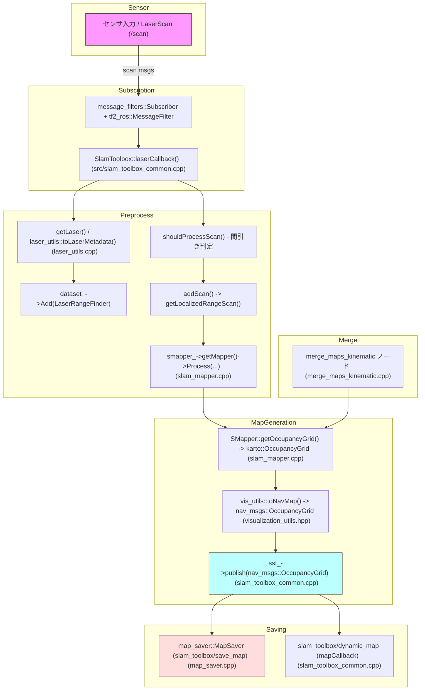

## 処理の要約（スキャン受信 → 占有格子生成・publish・保存）

この文書は `slam_toolbox` パッケージ内で、LaserScan を受け取って占有格子（nav_msgs::msg::OccupancyGrid）を生成し、ROS トピックで配信・保存するまでの主要処理経路を整理したものです。

---

### ライフサイクルノード: `src/slam_toolbox/src/slam_toolbox_common.cpp`

- setROSInterfaces()
  - `sst_` : `nav_msgs::msg::OccupancyGrid` を publish する publisher を作成（トピック名は `map_name_`、デフォルト `/map`）。
  - `ssMap_` : `nav_msgs::srv::GetMap` 相当のサービス（`slam_toolbox/dynamic_map`）を作成し、`mapCallback()` で現在の地図を返せるようにする。
  - LaserScan 受信用に `message_filters::Subscriber` と `tf2_ros::MessageFilter` を設定し、受信コールバックを `SlamToolbox::laserCallback()` に接続する。

- laserCallback() / getLaser() / shouldProcessScan() / addScan()
  - 受信した `sensor_msgs::msg::LaserScan` からタイムスタンプと TF を用いて odom 上の pose を求める（`pose_helper_` を使用）。
  - `getLaser()` は Karto 互換のレーザ表現（例: LaserRangeFinder）を初期化するユーティリティ。
  - `shouldProcessScan()` は走行距離・角度変化・レート等の閾値でスキャンを間引き（処理頻度を制御）。処理対象と判断したスキャンを `addScan()` に渡す。
  - `addScan()` は `getLocalizedRangeScan()` を作成し、内部 mapper に渡して `smapper_->getMapper()->Process(...)` を実行する（SLAM の核心処理は `src/slam_toolbox/src/slam_mapper.cpp` 側で行われる）。成功時は `publishPose()` を呼び、`dataset_->Add(range_scan)` でスキャンを内部データセットに保存する。

- publishVisualizations() / updateMap()
  - ビジュアライゼーションや地図更新は別スレッドで周期的に実行される。`publishVisualizations()` が `map_update_interval` に従って `updateMap()` を呼ぶ。
  - `updateMap()` は `SMapper::getOccupancyGrid(resolution_)` を呼び、Karto の `karto::OccupancyGrid` を取得する。続けて `vis_utils::toNavMap()` を使用して ROS の `nav_msgs::msg::OccupancyGrid` に変換し、`sst_->publish(map)` とメタデータ publisher（`sstm_`）で配信する。
  - map の publisher は `transient_local` QoS を使うことが多く、直近の地図を遡及購読できるようにしている点に注意。

- mapCallback()
  - `slam_toolbox/dynamic_map` サービスの実装。現在ノードが保持する `map_`（`nav_msgs::msg::OccupancyGrid`）を呼び出し元に返す。

参照: `src/slam_toolbox/src/slam_toolbox_common.cpp`

---

### Mapper ラッパー（Karto 連携）: `include/slam_toolbox/slam_mapper.hpp` / `src/slam_toolbox/src/slam_mapper.cpp`

- `mapper_utils::SMapper` は内部で `karto::Mapper`（Karto SLAM の実体）を保持し、スキャン登録・最適化・局所化支援など SLAM のコア処理を担う。
- SMapper::getOccupancyGrid(const double & resolution)
  - 内部の処理済スキャン集合（mapper が保持するスキャン）を基に、`karto::OccupancyGrid::CreateFromScans(scans, resolution, ...)` を呼んで Karto の占有格子を生成する。
  - 生成された `karto::OccupancyGrid` は上位の `updateMap()` に返され、ROS 型へ変換・配信される。

参照: `include/slam_toolbox/slam_mapper.hpp`, `src/slam_toolbox/src/slam_mapper.cpp`

---

### Karto -> ROS 変換ユーティリティ: `include/slam_toolbox/visualization_utils.hpp`

- vis_utils::toNavMap(const karto::OccupancyGrid * occ_grid, nav_msgs::msg::OccupancyGrid & map)
  - Karto の格子情報（幅・高さ・解像度・原点オフセット・内部確率など）を ROS の `nav_msgs::msg::OccupancyGrid` にマッピングする。
  - セル値の変換ルール（例: 未知 = -1、空 = 0、占有 = 100）や、origin（geometry_msgs::msg::Pose）への変換をここで行う。
  - `updateMap()` はこの関数を用いて `map_` を構築し、`sst_->publish(map_)` で配信する。

参照: `include/slam_toolbox/visualization_utils.hpp`

---

### マップ保存サービス: `include/slam_toolbox/map_saver.hpp` / `src/slam_toolbox/src/map_saver.cpp`

- `map_saver::MapSaver` の主な動作:
  - `slam_toolbox/save_map` サービスを提供し、保存リクエストを受け付ける。
  - `map_name_`（通常 `/map`）トピックをサブスクライブして最新の `nav_msgs::msg::OccupancyGrid` を内部キャッシュし、`received_map_` フラグで有無を管理する。
  - `saveMapCallback()` でキャッシュされた map が存在する場合、外部 CLI（`ros2 run nav2_map_server map_saver_cli ...`）を `system()` 経由で呼び出して PNG + YAML を出力する。
  - 注意点: 外部 CLI の呼び出しは実行環境に依存する（PATH、パッケージの有無、実行権限など）。戻り値は `system()` のステータスに依存するため、失敗時の扱いに注意が必要。

参照: `include/slam_toolbox/map_saver.hpp`, `src/slam_toolbox/src/map_saver.cpp`

---

### サブマップ統合ノード（オプション）: `src/slam_toolbox/src/merge_maps_kinematic.cpp`

- 複数のサブマップ（個々の `karto::Mapper` が持つスキャン集合）を取り込み、`karto::OccupancyGrid::CreateFromScans(...)` により統合地図を生成するノード。
- 統合後は `vis_utils::toNavMap()` を経て ROS の `nav_msgs::msg::OccupancyGrid` を publish する。マルチロボットや分割マップの統合に利用される。

参照: `src/slam_toolbox/src/merge_maps_kinematic.cpp`

---

## 全体フロー（要点）

1. LaserScan を受信（`SlamToolbox::laserCallback()`）。前処理で Karto 互換のレーザ表現を生成（`getLaser()`）。間引き条件（`shouldProcessScan()`）で処理するか判定。
2. 処理対象スキャンを `addScan()` に渡し、`smapper_->getMapper()->Process(...)` により登録／マップ更新を行う。成功時は `dataset_->Add(...)` と `publishPose()` を実行。
3. 別スレッドで `publishVisualizations()` が定期的に `updateMap()` を呼ぶ。`SMapper::getOccupancyGrid()` → `vis_utils::toNavMap()` → `sst_->publish()` で ROS トピックへ配信。
4. 永続化は `slam_toolbox/save_map`（`map_saver::MapSaver::saveMapCallback()`）で行い、内部キャッシュがあれば外部 CLI を呼んで PNG/YAML を作成する。動的取得は `slam_toolbox/dynamic_map`（`mapCallback()`）で応答する。

## 実運用での注意点

- map 保存処理は外部ツール（`map_saver_cli` 等）に依存するため、コンテナやデプロイ先にツールが存在するか確認する。
- map publisher は通常 `transient_local` に設定されるため、Late-joining subscriber が過去の地図を受け取れる。ネットワークや QoS 設定により挙動が変わる点に注意。
- スキャンの間引き（`shouldProcessScan()` の閾値）は精度・計算負荷に影響する。長時間運用や高速度移動時はパラメータ調整を推奨。

---

### 図: フロー図（概略）

---
