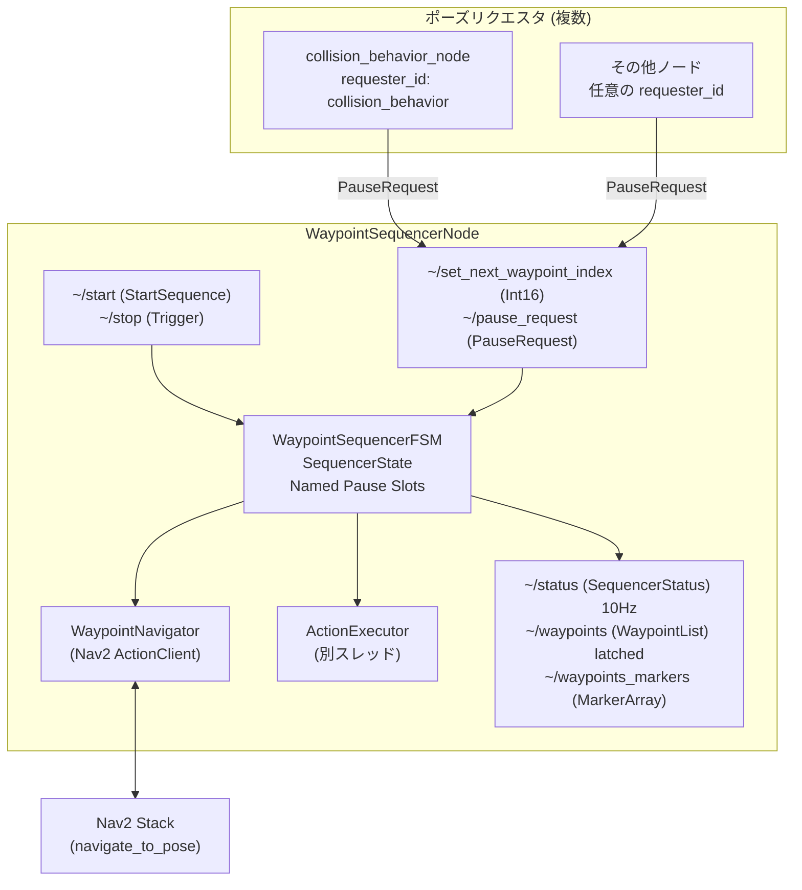
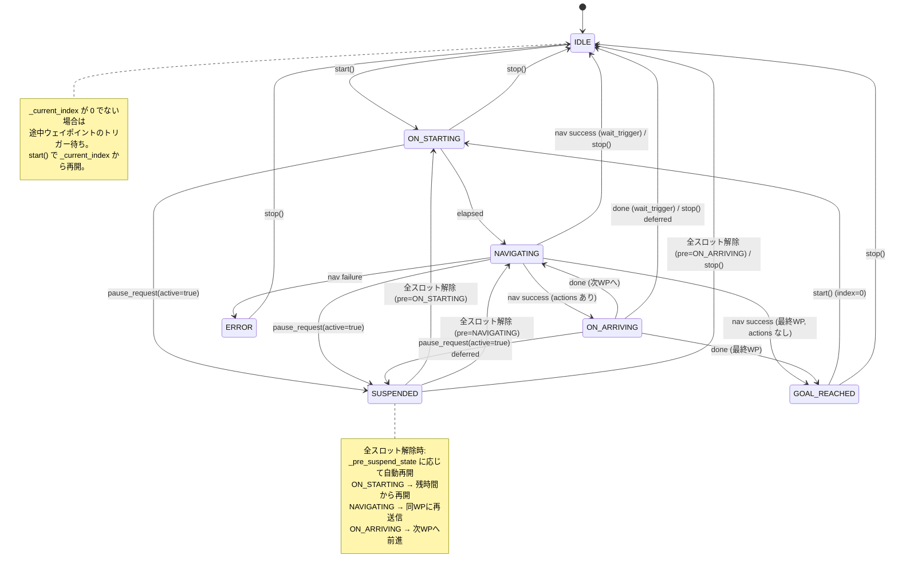

# mg_waypoint_navigation アーキテクチャ

## 概要

`mg_waypoint_navigation` は MG-01 の自律走行における経路追従を担うパッケージ。
従来の `waypoints_follower.py` (mg_navigation) を FSM ベースで完全再設計した。

---

## パッケージ構成

```
mg_waypoint_navigation/
  mg_waypoint_navigation/          # Python ライブラリ
    waypoint.py                    # データモデル v2.0
    waypoint_v1_compat.py          # v1→v2 変換ロジック
    waypoint_sequencer/
      states.py                    # SequencerState enum
      fsm.py                       # WaypointSequencerFSM
      navigator.py                 # WaypointNavigator (Nav2 ラッパー)
      action_executor.py           # ActionExecutor (別スレッド実行)
      actions/
        base.py                    # BaseAction
        generic.py                 # GenericServiceAction / GenericPublishAction
        builtins.py                # LoadMapAction / AmclResetAction / WaitAction
  scripts/
    waypoint_sequencer_node.py     # メインノード
    waypoint_editor_node.py        # ウェイポイント編集ノード
    migrate_waypoints.py           # v1→v2 変換ツール
  launch/
    waypoint_sequencer.launch.py
    waypoint_editor.launch.py
  behavior_trees/
    mg_navigate_to_pose_recovery_only_wait.xml
  rviz/
    waypoint_editor.rviz
  doc/
    architecture.md
    waypoint_format.md
```

---

## コンポーネント図



---

## FSM 状態遷移図



---

## ROS インターフェース

### WaypointSequencerNode

| 種別    | トピック/サービス名         | 型                               | 説明                                         |
| ------- | --------------------------- | -------------------------------- | -------------------------------------------- |
| Service | `~/start`                   | `mg_msgs/StartSequence`          | IDLE/GOAL_REACHED → ON_STARTING              |
| Service | `~/stop`                    | `std_srvs/Trigger`               | 任意状態 → IDLE                              |
| Sub     | `~/set_next_waypoint_index` | `std_msgs/Int16`                 | IDLE/SUSPENDED 時のみ有効                    |
| Sub     | `~/pause_request`           | `mg_msgs/PauseRequest`           | Named Pause Slot 制御 (複数ノードから送信可) |
| Pub     | `~/status`                  | `mg_msgs/SequencerStatus`        | 10Hz, パラメータで無効化可                   |
| Pub     | `~/waypoints`               | `mg_msgs/WaypointList`           | transient_local latched                      |
| Pub     | `~/waypoints_markers`       | `visualization_msgs/MarkerArray` | RViz 表示                                    |

### ノードパラメータ

| パラメータ                | 型     | デフォルト | 説明                             |
| ------------------------- | ------ | ---------- | -------------------------------- |
| `load_path`               | string | `""`       | ウェイポイント YAML パス         |
| `publish_waypoint_status` | bool   | `true`     | ステータスパブリッシュ有効/無効  |
| `waypoint_status_freq_hz` | double | `10.0`     | ステータスパブリッシュ周波数     |
| `publish_waypoints_list`  | bool   | `true`     | ウェイポイントリストパブリッシュ |

---

## Named Pause Slot 機構

複数のノードが独立して一時停止を要求できる仕組み。

- `pause_slots: Dict[str, float]` — `requester_id → heartbeat_period_s`
- スロットが1つでも存在すると SUSPENDED 状態を維持
- 全スロットが解放された時、`_pre_suspend_state` に応じて自動再開

---

## ON_ARRIVING 中の deferred 処理

アクション実行中に stop/pause が届いた場合:

- `_stop_pending = True` → アクション完了後に IDLE へ
- `_pause_pending = True` → アクション完了後に SUSPENDED へ
- stop が優先 (両方届いた場合は stop)
